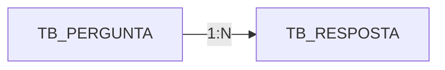

<p align="center">
  <h1>
    Microprojeto: Perguntas e Respostas  
  </h1>
</p>

<div style="display: flex; align-items: center; padding: 10px;">
  <span>
    <a href="https://github.com/rafael-o-cunha/">
        
    </a>
</span>
</div>

---

<div style="display: flex; align-items: center; padding: 10px;">
  <span>
    <a href="https://github.com/rafael-o-cunha/perguntas_e_respostas/blob/main/README.md">
      
    </a>
  </span>

  <span>
    <a href="https://github.com/rafael-o-cunha/perguntas_e_respostas/blob/main/README_EN.md">
      
    </a>
  </span>

  <span>
    <a href="https://github.com/rafael-o-cunha/perguntas_e_respostas/blob/main/README_ES.md">
      
    </a>
  </span>
</div>

---

<div style="display: flex; align-items: center; padding: 10px;">
  <span>
    
  </span>
  <span>
    
  </span>
  <span>
    
  </span>
  <span>
    
  </span>
  <span>
    
  </span>
</div>

---

## 📋 Resumo

&nbsp;&nbsp;&nbsp;&nbsp;&nbsp;&nbsp;&nbsp;&nbsp;**Perguntas e Respostas** é um microprojeto educacional desenvolvido em Node.js com o objetivo de praticar conceitos fundamentais de desenvolvimento web utilizando JavaScript/Node.js e o framework Express. Trata-se de uma aplicação simples, focada em aprendizado, que permite criar perguntas, visualizá‑las e responder dúvidas da comunidade, simulando funcionalidades essenciais presentes em sistemas web reais.

---

## 🎯 O Que É?

Uma plataforma minimalista do tipo **FAQ (Frequently Asked Questions)** ou **Sistema de Q&A**, onde:
- Usuários podem **criar e visualizar perguntas**
- Qualquer pessoa pode **adicionar respostas** às perguntas existentes
- As respostas são exibidas junto com a pergunta correspondente

---

## 🎓 Objetivo Educacional

Este projeto foi desenvolvido para praticar:

✅ **Criação e gerenciamento de conteúdo** — Implementação de um CRUD básico para perguntas e respostas, permitindo criar, listar, visualizar e armazenar dados no banco.

✅ **Modelagem de dados relacional** — Estruturação de tabelas com relacionamento 1:N (uma pergunta pode ter várias respostas), refletindo cenários reais de sistemas colaborativos.

✅ **Fluxo de requisições síncronas** — Processamento de formulários via POST, validação de dados e redirecionamentos.

✅ **Renderização dinâmica de páginas** — Uso de templates EJS para exibir perguntas, respostas e formulários de forma organizada.

✅ **Integração frontend-backend** — Combinação de Express, EJS e Bootstrap para entregar páginas responsivas e conectadas ao servidor.

✅ **Paginação e ordenação simples** — Exibição das perguntas ordenadas por data, simulando listagens comuns em sistemas de FAQ, fóruns e dashboards.

✅ **Persistência e consistência de dados** — Armazenamento seguro no PostgreSQL usando Sequelize como camada ORM.

✅ **Experiência de uso fluida** — Atualização em tempo real da lista de perguntas e respostas após cada envio, reforçando o ciclo completo de interação do usuário.

---

## 🛠️ Como Funciona?

### Fluxo de Operação (STAR):

&nbsp;&nbsp;&nbsp;&nbsp;&nbsp;&nbsp;&nbsp;&nbsp;Ouando o usuário acessa a aplicação web, ele vê uma lista de perguntas organizadas da mais recente para a mais antiga. A partir daí, pode criar uma nova pergunta acessando `/perguntar`, preenchendo título e descrição e enviando via POST, ou responder a uma pergunta existente entrando em `/responder/:id`, onde visualiza o conteúdo original e as respostas anteriores antes de adicionar a sua. O sistema então valida e armazena tudo no banco PostgreSQL e redireciona o usuário para a página correspondente, garantindo que as informações fiquem salvas e apareçam em tempo real.

---

## 🏗️ Estrutura do Projeto

```
.
├── index.js                 # Arquivo principal - configuração do servidor Express
├── package.json             # Dependências do projeto
├── database/                # Configuração de banco de dados
├── models/                  # Modelos (ORM)
├── views/                   # Templates EJS
│   └── partials/            # Componentes reutilizáveis
├── public/                  # CSS, Javascript e assets da aplicação
└── script.sql               # Query exemplo de relacionamento pergunta/resposta
```

---

## 💾 Banco de Dados

**Banco**: PostgreSQL
**Tabelas**: 

| Tabela | Descrição |
|--------|-----------|
| `tb_pergunta` | Armazena as perguntas |
| `tb_resposta` | Armazena as respostas |


---

## 🚀 Tecnologias Utilizadas

| Tecnologia | Propósito |
|-----------|----------|
| **Node.js** | Runtime JavaScript no servidor |
| **Express** | Framework web para roteamento e middleware |
| **EJS** | Template engine para renderizar views |
| **Sequelize** | ORM para abstração e gerenciamento do banco de dados |
| **PostgreSQL** | Banco de dados relacional |
| **Body-Parser** | Middleware para parsear corpo das requisições |
| **Nodemon** | Ferramenta de desenvolvimento (reinicia servidor automaticamente) |
| **Bootstrap** | Framework CSS para responsividade e componentes |

---

## 📌 Rotas da Aplicação

| Método | Rota | Descrição |
|--------|------|-----------|
| `GET` | `/` | Página inicial com lista de perguntas |
| `GET` | `/perguntar` | Formulário para criar pergunta |
| `POST` | `/salvarpergunta` | Salva pergunta no banco e redireciona para home |
| `GET` | `/responder/:id` | Exibe pergunta específica e suas respostas |
| `POST` | `/salvaresposta` | Salva resposta e redireciona para a pergunta |

---

## 🔧 Configuração de Conexão

**Credenciais do Banco** (em `database/database.js`):
```
Host: localhost
Port: 5432
User: rafael
Password: 123456
Database: db_perguntas
Dialect: PostgreSQL
```

*Nota: Não é uma aplicação para ambiente produtivo, mas para prática educacional*


