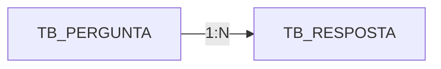

<p align="center">
  <h1>
    Microproject: Questions and Answers
  </h1>
</p>

<div style="display: flex; align-items: center; padding: 10px;">
  <span>
    <a href="https://github.com/rafael-o-cunha/">
        
    </a>
</span>
</div>

---

<div style="display: flex; align-items: center; padding: 10px;">
  <span>
    <a href="https://github.com/rafael-o-cunha/perguntas_e_respostas/blob/main/README.md">
      
    </a>
  </span>

  <span>
    <a href="https://github.com/rafael-o-cunha/perguntas_e_respostas/blob/main/README_EN.md">
      
    </a>
  </span>

  <span>
    <a href="https://github.com/rafael-o-cunha/perguntas_e_respostas/blob/main/README_ES.md">
      
    </a>
  </span>
</div>

---

<div style="display: flex; align-items: center; padding: 10px;">
  <span>
    
  </span>
  <span>
    
  </span>
  <span>
    
  </span>
  <span>
    
  </span>
  <span>
    
  </span>
</div>

---

## 📋 Summary

&nbsp;&nbsp;&nbsp;&nbsp;&nbsp;&nbsp;&nbsp;&nbsp;**Questions and Answers** is an educational microproject developed in Node.js with the goal of practicing fundamental web development concepts using JavaScript/Node.js and the Express framework. It's a simple, learning-focused application that allows users to create questions, view them, and answer community queries, simulating essential functionalities found in real web systems.

---

## 🎯 What is it?

A minimalist **FAQ (Frequently Asked Questions)** or **Q&A system** platform where:

- Users can **create** and **view questions**.
- Anyone can **add answers** to existing questions.
- Answers are displayed alongside the corresponding question.

---

## 🎓 Educational Objective

This project was developed for practice:

✅ **Content Creation and Management** — Implementation of a basic CRUD for questions and answers, allowing the creation, listing, viewing, and storage of data in the database.

✅ **Relational Data Modeling** — Structuring tables with a 1:N relationship (one question can have multiple answers), reflecting real-world scenarios of collaborative systems.

✅ **Synchronous Request Flow** — Processing forms via POST, data validation, and redirects.

✅ **Dynamic Page Rendering** — Use of EJS templates to display questions, answers, and forms in an organized manner.

✅ **Frontend-Backend Integration** — Combination of Express, EJS, and Bootstrap to deliver responsive pages connected to the server.

✅ **Simple Pagination and Sorting** — Display of questions sorted by date, simulating common listings in FAQ systems, forums, and dashboards.

✅ **Data Persistence and Consistency** — Secure storage in PostgreSQL using Sequelize as the ORM layer.

✅ **Fluid User Experience** — Real-time updates to the list of questions and answers after each submission, reinforcing the complete user interaction cycle.

---

## 🛠️ How does it work?

### Operation Flow (STAR):

&nbsp;&nbsp;&nbsp;&nbsp;&nbsp;&nbsp;&nbsp;&nbsp;When a user accesses the web application, they see a list of questions organized from newest to oldest. From there, they can create a new question by accessing `/perguntar`, filling in the title and description, and submitting it via POST, or answer an existing question by going to `/responder/:id`, where they can view the original content and previous answers before adding their own. The system then validates and stores everything in the PostgreSQL database and redirects the user to the corresponding page, ensuring that the information is saved and appears in real time.

---

## 🏗️ Project Structure

```
.
├── index.js                 # Main file - Express server configuration
├── package.json             # Project dependencies
├── database/                # Database configuration
├── models/                  # Models (ORM)
├── views/                   # EJS Templates
│   └── partials/            # Reusable components
├── public/                  # CSS, Javascript, and application assets
└── script.sql               # Example query for a question/answer relationship.
```

---

## 💾 Database

**Database**: PostgreSQL
**Tables**: 

| Table | Description |
|--------|-----------|
| `tb_pergunta` | Stores the questions |
| `tb_resposta` | Stores the answers |


---

## 🚀 Technologies Used

| Technology | Purpose |
|-----------|----------|
| **Node.js** | Server-side JavaScript runtime |
| **Express** | Web framework for routing and middleware |
| **EJS** | Template engine for rendering views |
| **Sequelize** | ORM for database abstraction and management |
| **PostgreSQL** | Relational database |
| **Body-Parser** | Middleware for parsing request bodies |
| **Nodemon** | Development tool (automatically restarts server) |
| **Bootstrap** | CSS framework for responsiveness and components |

---

## 📌 Application Routes

| Method | Route | Description |
|--------|------|-----------|
| `GET` | `/` | Homepage with list of questions|
| `GET` | `/perguntar` | Form to create a question |
| `POST` | `/salvarpergunta` | Saves question to database and redirects to home |
| `GET` | `/responder/:id` | Displays specific question and its answers |
| `POST` | `/salvaresposta` | Saves answer and redirects to the question |

---

## 🔧 Connection Configuration

**Database Credentials** ( `database/database.js`):
```
Host: localhost
Port: 5432
User: rafael
Password: 123456
Database: db_perguntas
Dialect: PostgreSQL
```

*Note: This is not an application for a production environment, but for educational practice.*


