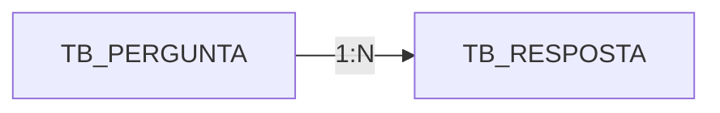

<p align="center">
  <h1>
    Microproyecto: Preguntas y respuestas 
  </h1>
</p>

<div style="display: flex; align-items: center; padding: 10px;">
  <span>
    <a href="https://github.com/rafael-o-cunha/">
        
    </a>
</span>
</div>

---

<div style="display: flex; align-items: center; padding: 10px;">
  <span>
    <a href="https://github.com/rafael-o-cunha/perguntas_e_respostas/blob/main/README.md">
      
    </a>
  </span>

  <span>
    <a href="https://github.com/rafael-o-cunha/perguntas_e_respostas/blob/main/README_EN.md">
      
    </a>
  </span>

  <span>
    <a href="https://github.com/rafael-o-cunha/perguntas_e_respostas/blob/main/README_ES.md">
      
    </a>
  </span>
</div>

---

<div style="display: flex; align-items: center; padding: 10px;">
  <span>
    
  </span>
  <span>
    
  </span>
  <span>
    
  </span>
  <span>
    
  </span>
  <span>
    
  </span>
</div>

---

## 📋 Resumen

&nbsp;&nbsp;&nbsp;&nbsp;&nbsp;&nbsp;&nbsp;&nbsp; **Preguntas y respuestas** Este es un microproyecto educativo desarrollado en Node.js con el objetivo de practicar conceptos fundamentales de desarrollo web utilizando JavaScript/Node.js y el framework Express. Es una aplicación sencilla y orientada al aprendizaje que permite a los usuarios crear preguntas, visualizarlas y responder a las consultas de la comunidad, simulando funcionalidades esenciales de sistemas web reales.

---

## 🎯 ¿Qué es?

Una plataforma minimalista similar a un sistema de preguntas frecuentes (FAQ) o de preguntas y respuestas, donde:
- Los usuarios pueden crear y ver preguntas
- Cualquiera puede añadir respuestas a preguntas existentes
- Las respuestas se muestran junto a la pregunta correspondiente

---

## 🎓 Objetivo Educativo

Este proyecto fue desarrollado para la práctica:

✅ **Creación y gestión de contenido**: Implementación de un CRUD básico para preguntas y respuestas, que permite crear, listar, visualizar y almacenar datos en la base de datos.

✅ **Modelado de datos relacionales**: Estructura de tablas con una relación 1:N (una pregunta puede tener múltiples respuestas), reflejando escenarios reales de sistemas colaborativos.

✅ **Flujo de solicitudes síncrono**: Procesamiento de formularios mediante POST, validación de datos y redirecciones.

✅ **Renderizado dinámico de páginas**: Uso de plantillas EJS para mostrar preguntas, respuestas y formularios de forma organizada.

✅ **Integración front-backend**: Combinación de Express, EJS y Bootstrap para ofrecer páginas responsivas conectadas al servidor.

✅ **Paginación y ordenación sencillas**: Visualización de preguntas ordenadas por fecha, simulando listados comunes en sistemas de preguntas frecuentes, foros y paneles de control.

✅ **Persistencia y consistencia de datos**: Almacenamiento seguro en PostgreSQL con Sequelize como capa ORM.

✅ **Experiencia de usuario fluida**: Actualizaciones en tiempo real de la lista de preguntas y respuestas después de cada envío, lo que refuerza el ciclo completo de interacción del usuario.

---

## 🛠️ ¿Cómo funciona?

### Flujo operativo (STAR):

&nbsp;&nbsp;&nbsp;&nbsp;&nbsp;&nbsp;&nbsp;&nbsp;Cuando un usuario accede a la aplicación web, ve una lista de preguntas organizadas de la más reciente a la más antigua. Desde allí, puede crear una nueva pregunta accediendo a `/perguntar`, completando el título y la descripción y enviándola por POST, o responder a una pregunta existente accediendo a `/responder/:id`, donde puede ver el contenido original y las respuestas anteriores antes de agregar las suyas. El sistema valida y almacena todo en la base de datos PostgreSQL y redirige al usuario a la página correspondiente, garantizando que la información se guarde y aparezca en tiempo real.

---

## 🏗️ Estructura del proyecto

```
.
├── index.js                 # Archivo principal - Configuración del servidor Express
├── package.json             # Dependencias del proyecto
├── database/                # Configuración de la base de datos
├── models/                  # Modelos (ORM)
├── views/                   # Plantillas EJS
│   └── partials/            # Componentes reutilizables
├── public/                  # CSS, Javascript y recursos de la aplicación
└── script.sql               # Consulta de ejemplo para la relación pregunta-respuesta
```

---

## 💾 Base de datos

**Banco**: PostgreSQL
**tabla**: 

| tabla | Descripción |
|--------|-----------|
| `tb_pergunta` | Almacena las preguntas |
| `tb_resposta` | Almacena las respuestas |


---

## 🚀 Tecnologías utilizadas

| Tecnología | Objetivo |
|-----------|----------|
| **Node.js** | Tiempo de ejecución de JavaScript del lado del servidor |
| **Express** | Framework web para enrutamiento y middleware |
| **EJS** | Motor de plantillas para renderizar vistas |
| **Sequelize** | ORM para abstracción y gestión de bases de datos |
| **PostgreSQL** | Base de datos relacional |
| **Body-Parser** | Middleware para analizar cuerpos de solicitudes |
| **Nodemon** | Herramienta de desarrollo (reinicia automáticamente el servidor) |
| **Bootstrap** | Framework CSS para capacidad de respuesta y componentes |

---

## 📌 Rutas de aplicación

| Método | Ruta | Descripción |
|--------|------|-----------|
| `GET` | `/` | Página de inicio con lista de preguntas |
| `GET` | `/perguntar` | Formulario para crear una pregunta |
| `POST` | `/salvarpergunta` | Guarda la pregunta en la base de datos y redirige a la página de inicio |
| `GET` | `/responder/:id` | Muestra la pregunta específica y sus respuestas |
| `POST` | `/salvaresposta` | Guarda la respuesta y redirige a la pregunta |

---

## 🔧 Configuración de conexión

**Credenciales de Banco** ( `database/database.js`):
```
Host: localhost
Port: 5432
User: rafael
Password: 123456
Database: db_perguntas
Dialect: PostgreSQL
```

*Nota: Esta no es una aplicación para un entorno de producción, sino para la práctica educativa.*


